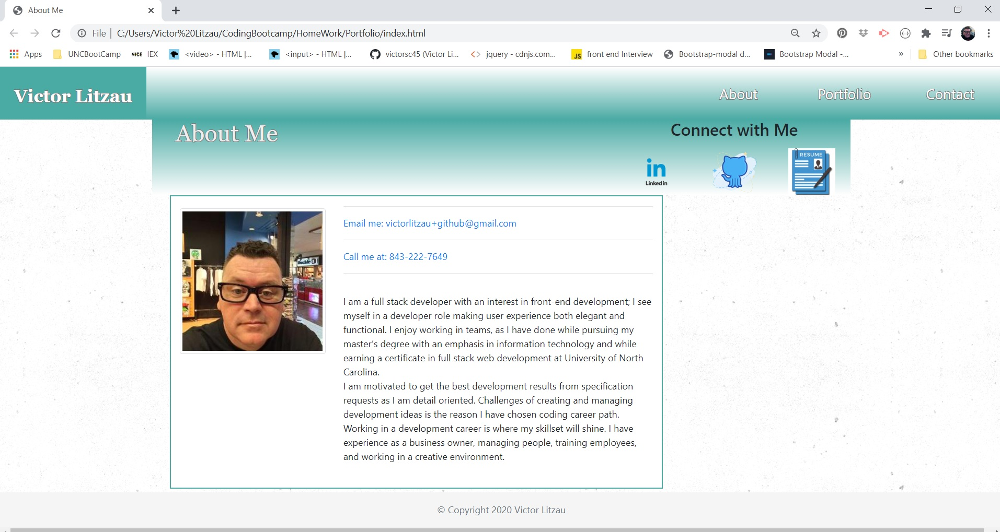
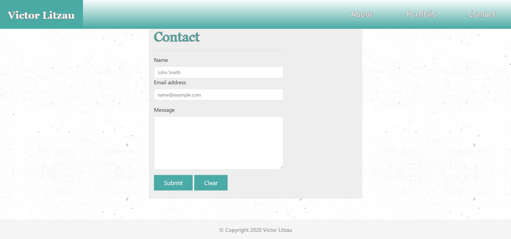
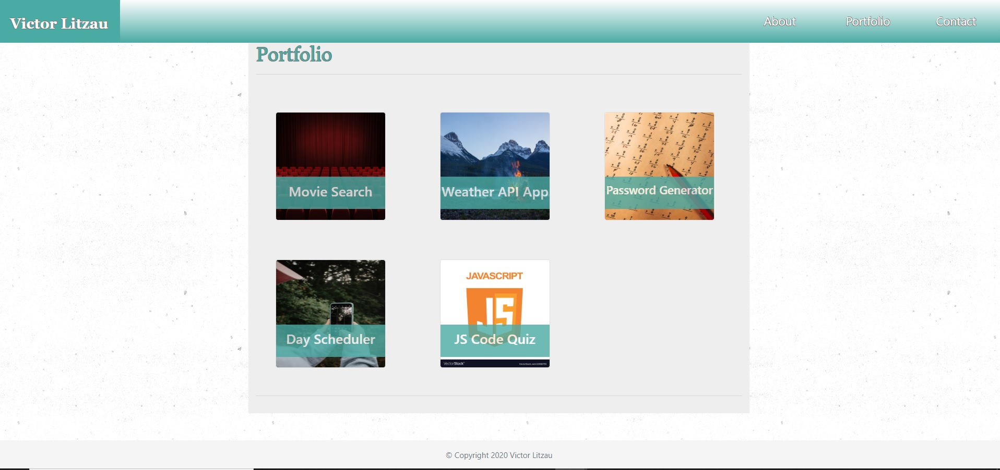

# Portfolio

>professional portfolio website: Deployed link below:

https://victorsc45.github.io/Portfolio/

 # Table of Contents
  <!-- toc -->
  * [Description](#description)
  * [Screen Shots of Mock up](#screen)
  * [Portfolio](#portfolio)
  * [Spec Criteria](#criteria)
  * [Minimum Requirements](#requirements)
  * [Screenshots of the deployed application](#screenshots)
  * [Link to Video module](#Link)
  * [Installation](#Installation)
  * [Review](#review)
  * [Credits](#credits)
  * [License](#license)
  * [Tests](#tests)
   <!-- toc stop -->

# Description

   * Using Bootstrap, develop your portfolio site with the following items:

   * A navbar

   * A responsive layout

   * About Me home page

   * A Portfolio page with images that link to deployed projects
   
   * Contact page for users to contact me by email using their default email service or provider

   * Screenshots are provided as a reference in the `Assets/Images` folder. Used Bootstrap to create a similar, responsive layout.
# Screen Shots of Mock up
   
   
   
  
# Portfolio

  * Project 1: 
  > Collaboration project using API/AJAX calls to search movie titles and find what streaming service offers them 

  * Weather Dashboard Application:
  > Uses multiple API calls to show current and forecasts of weather in cities around the world

  * Password Generator:
  > Created using JS allowing user to generate a password with multiple criteria up to 128 character passwords 

  * Work-day Scheduler:
  > Is an application that uses local storage and JS functions to dynamically create the HTML view so that users can input text input for daily work activities and track daily activity

  * JS Code Quiz:
  > Is a game created in JavaScript to test the knowledge of JavaScript code. It is created with local storage for retaining high scores and uses timer functions
  
## Spec Criteria

* Use Bootstrap's grid system (containers, rows, and columns).

* Use an HTML validation service to ensure that each page has valid HTML

* Mobile-first design

* Choose a color palette for your site so it doesn't just look like
the default bootstrap theme or an unstyled HTML site.

* Make sure the font size is large enough to read, and that the colors don't cause eye strain.

### Minimum Requirements

* Functional, deployed application

* GitHub repository with README describing the project

* Navbar must be consistent on each page.

* Navbar on each page must contain links to Home/About, Contact, and Portfolio pages.

* All links must work.

* Must use semantic html.

* Each page must have valid and correct HTML. (use a validation service)

* Must properly utilize Bootstrap components and grid system.

* Using Bootstrap, made a sticky footer and use sub-rows and sub-columns on your portfolio site

* Your name

* Links to your GitHub profile & LinkedIn page as well as your email address and phone number

* A link to a PDF of your resume

* A list of projects. For each project, make sure you have the following:

  * Project title

  * Link to the deployed version

  * Link to the GitHub repository 
  > The link to the GitHub repository is on the **About Me** page and contains all the pinned projects in that Overview

# Screenshots of the deployed application

* * 

* * 

* * 

# Link to Video module showing the navigation of this Portfolio

''' https://drive.google.com/file/d/1VdVk3hmtHWQ-j5jbrkOXmEBpF_SpwHI-/view '''

# Instulation

> N/A at this time simply follow the url presented above and follow the links in the Portfolio to learn more about my projects and me!

# Review

Ensure accessibility and source code legibility. UX funtional and bootstrap responsiveness and updated links to operational status.

# Credits

The following links were used as reference as research.

https://developer.mozilla.org/en-US/docs/Web/HTML

'''
https://www.w3.org/standards/webdesign/accessibility

'''
''' bootstrap components link starting 'A' and descending '''

https://getbootstrap.com/docs/4.5/components/alerts/

'''
#### Photo credits
* thanks to Unsplashed and dPhoto by Tanner Ross on Unsplash music
* Photo by Courtnie Tosana on Unsplash fire and ice
* Photo by Chris Liverani on Unsplash math picture 
* Photo by Ibrahim Rifath on Unsplash grid on phone picture
* Photo by Andrew Buchanan on Unsplash
* background texture Concrete Wall Made by Atle Mo ''' https://www.transparenttextures.com/ '''

# Licence
  
  >  []
    
  ### :octocat:

# Tests

* Responsive look of web application: view the link to the video module below

''' https://drive.google.com/file/d/1crWA8UjjsH_H-B4vjU-4ALdOoO9RGzg0/view '''

